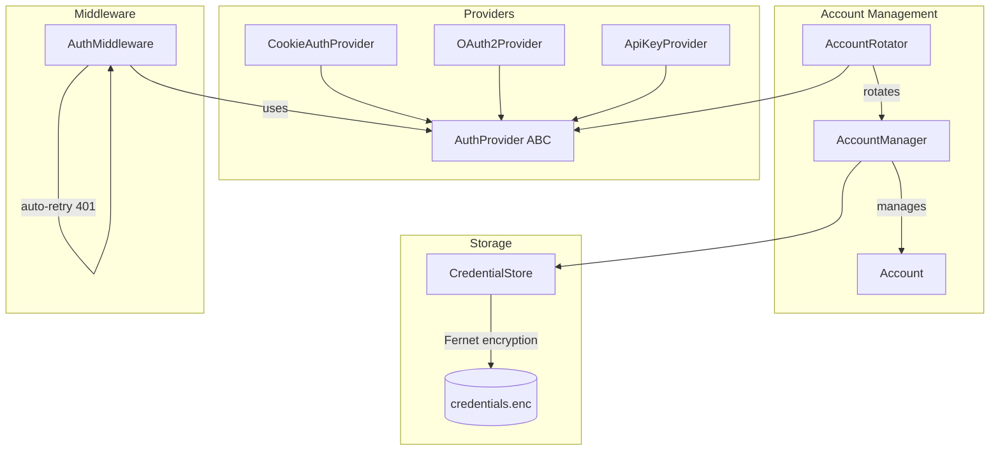

# Marketplace Auth Manager

Multi-platform authentication management library supporting cookie-based auth (Wallapop), OAuth2 (eBay), and API key providers — with multi-account rotation, encrypted credential storage, and request middleware.

## Architecture



## Features

- **Cookie Auth** — Extract bearer tokens from browser cookies (Wallapop-style platforms). Parses JWT payloads to track expiry without signature verification.
- **OAuth2** — Full authorization code grant flow with automatic token refresh, scope management, and token persistence.
- **API Key** — Static key injection with runtime rotation support.
- **Multi-Account Rotation** — Round-robin across healthy accounts with automatic cooldown after rate-limiting.
- **Encrypted Storage** — Fernet-encrypted JSON file storage. Encryption key auto-generated on first use; plaintext secrets never touch disk.
- **Request Middleware** — Transparently injects auth headers and retries on 401 with a fresh token.

## Installation

```bash
pip install -r requirements.txt
```

## Quick Start

```python
from src import CookieAuthProvider, AuthMiddleware
import requests

# Cookie-based auth (e.g. Wallapop)
provider = CookieAuthProvider(
    cookies={"access_token": "<jwt_from_browser>"}
)
provider.authenticate()

# Auto-inject auth into requests
middleware = AuthMiddleware(provider)
session = requests.Session()
response = middleware.get(session, "https://api.wallapop.com/v2/items")
```

```python
from src import AccountManager, AccountRotator

# Multi-account rotation
manager = AccountManager()
manager.add_account("ebay", "shop_eu", {"client_id": "...", "secret": "..."})
manager.add_account("ebay", "shop_us", {"client_id": "...", "secret": "..."})

rotator = AccountRotator(manager, "ebay", cooldown_seconds=30)
account = rotator.get_next_account()  # round-robin, skips unhealthy
```

## Design Decisions

| Decision | Rationale |
|---|---|
| ABC for providers | Uniform interface lets middleware and rotator work with any auth strategy |
| JWT parsed without verification | We only need expiry tracking, not trust — the server validates signatures |
| Fernet encryption | Symmetric, authenticated encryption with zero config (key auto-generated) |
| Round-robin with cooldown | Fair distribution prevents hammering a single account after rate-limits |
| Middleware retry on 401 | Transparent token refresh avoids boilerplate in every API call |

## Running Tests

```bash
pytest tests/ -v
```

## Project Structure

```
src/
├── providers/          # Auth strategy implementations
│   ├── base.py         # AuthProvider ABC + AuthType enum
│   ├── cookie_provider.py
│   ├── oauth2_provider.py
│   └── apikey_provider.py
├── accounts/           # Multi-account management
│   ├── account_manager.py
│   └── account_rotator.py
├── storage/            # Encrypted persistence
│   └── credential_store.py
└── middleware/         # Request auth injection
    └── auth_middleware.py
```

## License

MIT
